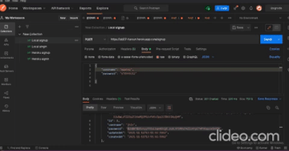
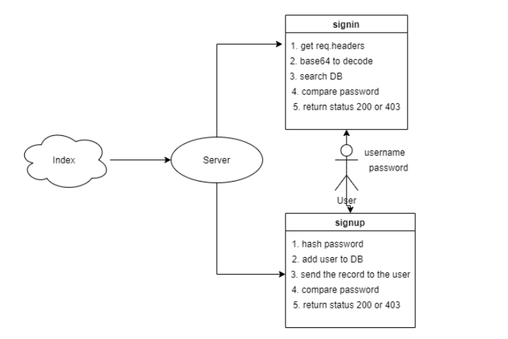

## Author: Mohammad Haroun
just press on them 
you can see sign in and sign up routes by using postman or thunder( because they are not get routes)

* [Deployment Link (Heroku) ](https://lab07-haroun.herokuapp.com/users)

* 

* [Test Report Link ](https://github.com/Mohammad-Haroun-97/api-server/actions)
* [Pull request Link ](https://github.com/Mohammad-Haroun-97/bearer-auth/pull/5)
# Setup
* .env requirements
* PORT - Port Number
* npm i sequelize sequelize-cli pg sqlite3
# Running the app
npm start

# Tests
Unit Tests: npm run test

# Working Diagram 

